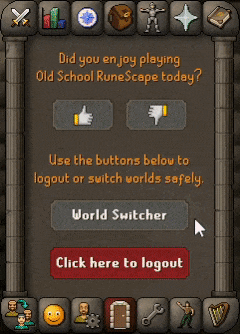
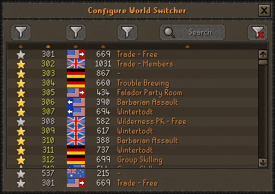

# World Hider
Hides your world so you can stream in peace

## Features
The plugin hides your world information in various interfaces and menus.

### World switcher interface
Hides world information in the world switcher, such as the title bar, world number, flag, population and activity.  

### World switcher settings interface
Hides world information in the world switcher configuration panel.  

### Community chat channels
World information can be made hidden, players on the same world are yellow, within:

+ Friends chat channel  
+ Clan chat channel  
+ Guest clan chat channel  
+ Group activity channel  

### Friend and ignore list
World information is hidden for the interface title bar and players in the friends and ignore list.