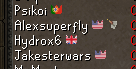
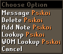

# Wise Old Man
Helps you manage your wiseoldman.net group.

## Features
#### Automation
- Automatically sends name changes of you (if you are in a clan chat) and your friends to [WOM](https://wiseoldman.net).
- Automatically updates your gains on log out (If you have gained at least 10k xp).

#### Add & Remove options
Add and Remove group members from the Clan Chat and Friends list.

#### Clan tab options
Right click menu options, on the Clan Chat tab, to import group members and go to the group page on [WOM](https://wiseoldman.net) (See screenshots below).

#### Group icon
Adds an icon next to the names of people, in the clan chat, friends list and ignore list, who are in the configured group.

#### WOM Lookup
Adds a WOM lookup option that lets you look up a player's stats. This only works for people who are tracked on Wise Old Man.

### Configuration
##### Group
- Show icons: Adds the group icon next to players names who are in the group.
- Show flags: Changes the default blue crown to a country flag.
- Import Group option: Adds the Import Group option to the clan chat tab.
- Browse Group option: Adds the Browse Group option to the clan chat tab.
- Add/Remove Member option: Adds Add and Remove member options to the player menu in clan chat and friends list.
- Group id: This is the group id that can be found on the group page on WOM. [Example.](https://wiseoldman.net/groups/139)
- Verification code: This is the verification code you get when you create the group, which is used to edit the group.

##### Lookup
- Player option: Adds the WOM Lookup option when right clicking a player.
- Menu option: Adds the WOM Lookup option in the right click menu.

### Future plans
 - Create groups/competitions from clan chat members
 - Create groups/competitions from friends
 - Feel free to suggest more..
 
 ### Support & Suggestions
 If you have suggestions or need support, feel free to join our Discord server [here.](https://wiseoldman.net/discord)

