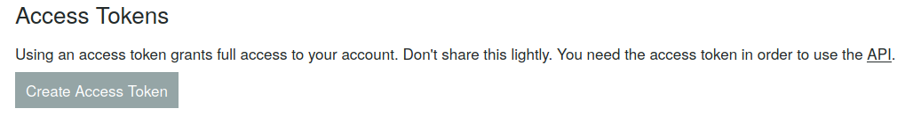

# Push Notifications
Send notifications to your phone or other devices, currently this only supports [Pushbullet](https://www.pushbullet.com/).
## Pushbullet
You need to provide a pushbullet api key to use this service.
Go [here](https://www.pushbullet.com/#settings) and click create new token or use your existing one.

The generated key will be in the format `o.Dorf43jdDIepfKeroPewfjeIUHJ4MrOP`.

Open your client and paste the key into the `Pushbullet` config field of `Push Notifications` to enable phone notifications.