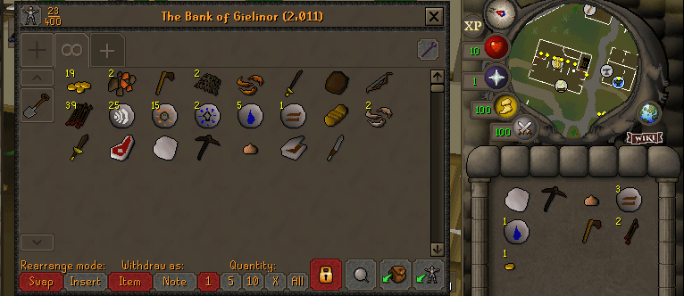

# Bank Diff
See your bank progress from a certain point in time.

## Why?

Useful primarily when you are doing from scratch challenges with friends, because it allows you to easily keep track of what you have in your bank without you having to clean it beforehand. But it can be used to track any progress between two points in time.

## How to use?

1. Save a bank snapshot to base your diff on
2. Toggle the diff view

You can reset the bank snapshot at any point in time.