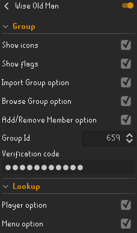

# Wom Utils
Utils for wiseoldman.net

## Features
### Automation
- Automatically sends name changes of you(if you are in a friends chat) and your friends to [WOM](https://wiseoldman.net).
- Automatically updates your gains on log out (If you have gained at least 10k xp).

### Add & Remove options
Add and Remove group members from the Clan Chat and Friends list.

### Clan tab options
Right click menu options, on the Clan Chat tab, to import group members and go to the group page on [WOM](https://wiseoldman.net) (See screenshots below).

### Group icon
Adds an icon next to the names of people, in the clan chat, friends list and ignore list, who are in the configured group.

## Configuration
- Show icons: Adds the group icon next to players names who are in the group.
- Menu options: Adds the Add, Remove, Browse and Import options to the right click menus of players and clan chat tab.
- Group id: This is the group id that can be found on the group page on WOM. [Example.](https://wiseoldman.net/groups/139)
- Verification code: This is the verification code you get when you create the group, which is used to edit the group.

## Future plans
 - Create groups/competitions from clan chat members
 - Create groups/competitions from friends
 - Feel free to suggest more..
 
 ## Support & Suggestions
 If you have suggestions or need support, feel free to join our Discord server [here.](https://wiseoldman.net/discord)

